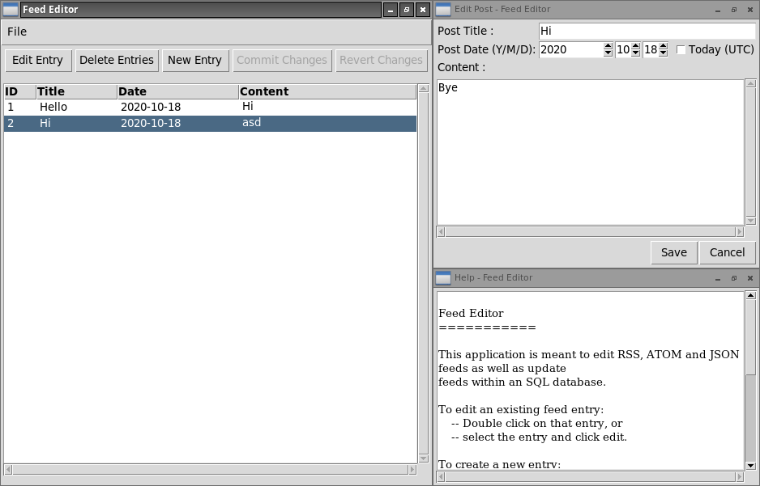

tknewsedit - A Generic News Feed Editor
=======================================

This is a feed editing application written in python and with Tk as the GUI
library. The application can be adapted to suit needs of any use case, such as
in the case of text storage formats like RSS and ATOM, as well as databases.
Interaction with the databases takes place through an abstract interface in the
form of *driver* classes.

An example is available in `flask_news_editor.py` wherein a driver is
implemented for flask_sqlalchemy's database environment. If placed in the
appropriate `venv` directory with the correct database model and session
import/assignment, the program can be used as-is with the `run_flask_news_editor`
script.

## Screenshot

